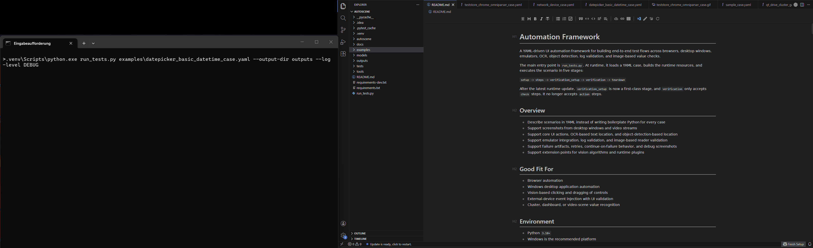
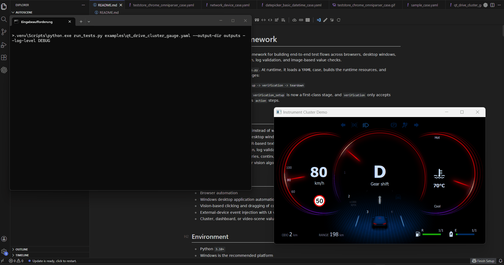

# Automation Framework

[](https://github.com/TpppT/autoscene/actions/workflows/ci.yml)

A YAML-driven UI automation framework for building end-to-end test flows across browsers, desktop apps, emulators, embedded systems, and mobile devices with OCR, object detection, log validation, and image-based value checks.

The main entry point is `run_tests.py`. At runtime, it loads a YAML case, builds the runtime resources, and executes the scenario in five stages:

`setup -> steps -> verification_setup -> verification -> teardown`

After the latest runtime update, `verification_setup` is now a first-class stage, and `verification` only accepts `check` steps. It no longer accepts `action` steps.

## Overview

- Describe scenarios in YAML instead of writing boilerplate Python for every case
- Support screenshots from desktop windows, embedded displays, mobile devices, and video streams
- Support core UI actions, OCR-based text location, and object-detection-based location when DOM trees are unavailable or controls are custom-drawn
- Support emulator integration, log validation, and image-based reader validation
- Support failure artifacts, retries, continue-on-failure behavior, and debug screenshots
- Support extension points for vision algorithms and runtime plugins

## Demo GIFs

These previews match the example cases below and show the framework in action.

### `examples/datepicker_basic_datetime_case.yaml`



### `examples/teststore_chrome_omniparser_case.yaml`


### `examples/outrun_hvac_audio_balance_case.yaml`


### `examples/qt_drive_cluster_gauge.yaml`



## Good Fit For

- Browser and web application automation
- Desktop, embedded, and mobile UI automation
- Vision-based clicking, dragging, and control interaction
- UIs where the DOM tree is unavailable or controls are custom-drawn
- External-device or system event injection with UI validation
- Cluster, dashboard, display, or video-scene value recognition

## Environment

- Python `3.10+`
- Windows is the recommended platform
- Optional dependencies:
  - `Tesseract OCR` when `ocr.type: tesseract`
  - Chrome or another browser when the case uses `open_browser`
  - `ultralytics` plus model files when the case uses `yolo` or `omniparser`

Notes:

- The framework currently includes adaptations for Windows window titles, mouse and keyboard control, and DPI awareness.
- `capture.window_title` must match a real window title on the machine.
- The example YAML files are best used as templates. Aside from `examples/mock_case.yaml`, most of them need local adjustments before they can run successfully.

## Installation

```powershell
python -m venv .venv
.\.venv\Scripts\Activate.ps1
pip install -r requirements.txt
pip install -r requirements-dev.txt
```

If you want YOLO or OmniParser support:

```powershell
pip install -r requirements-yolo.txt
```

If you want to use Tesseract:

```yaml
ocr:
  type: tesseract
  tesseract_cmd: 'C:\Program Files\Tesseract-OCR\tesseract.exe'
```

License note:

- This repository's source code is MIT-licensed
- Optional third-party dependencies such as `ultralytics` keep their own licenses
- Bundled model files under `models/` may also have separate license terms
- See `THIRD_PARTY_NOTICES.md` before distributing YOLO-based setups

## Zero-Setup Smoke Test

`examples/mock_case.yaml` is the repo-bundled smoke example. It uses a checked-in static image plus mock OCR and detector fixtures, so it does not require a real window, browser, camera, OCR installation, or model files.

Run it from the repository root with:

```powershell
.\.venv\Scripts\python.exe .\run_tests.py .\examples\mock_case.yaml --output-dir .\outputs
```

Expected artifacts:

- `outputs/mock_case.log`
- `outputs/mock_frame.png`

## Quick Start

Start by copying the example under `examples/` that is closest to your scenario, then adjust the window title, model paths, OCR path, and capture regions for your environment.

Run a case with:

```powershell
python .\run_tests.py .\path\to\case.yaml
python .\run_tests.py .\path\to\case.yaml --output-dir outputs --log-level DEBUG
```

Command-line arguments:

- `case`: path to the YAML test case
- `--output-dir`: output directory for runtime artifacts, default `outputs`
- `--log-level`: `DEBUG | INFO | WARNING | ERROR`, default `INFO`

Typical outputs:

- `outputs/<case-name>.log`: runtime log
- `outputs/*.png`: screenshots or debug images
- `outputs/*_failure.json`: structured failure artifacts for failed steps

## Execution Stages

| Stage | Purpose | Supported content |
| --- | --- | --- |
| `setup` | Prepare the environment, launch a browser, activate windows, initialize emulators | `action` / `check` |
| `steps` | Main scenario flow | `action` / `check` |
| `verification_setup` | Preparation before final verification, such as re-activating a window or waiting for the page to settle | `action` / `check` |
| `verification` | Final assertions | `check` only |
| `teardown` | Cleanup and finish-up work | `action` / `check` |

Important rules:

- `verification` cannot contain `action`
- If you need actions before the final assertions, put them in `verification_setup`
- `setup`, `steps`, `verification_setup`, and `teardown` can mix `action` and `check`

A common pattern:

```yaml
verification_setup:
  - action: activate_window
    window_title: Google Chrome
  - check: wait_for_text
    locate:
      text: Ready

verification:
  - check: text_exists
    locate:
      text: Done
```

## Top-Level YAML Structure

```yaml
name: demo_case

emulator: {}
detector: {}
detectors: {}
readers: {}
log_sources: {}
ocr: {}
capture: {}

setup: []
steps: []
verification_setup: []
verification: []
teardown: []
```

Field reference:

- `name`: case name
- `emulator`: default emulator configuration
- `detector`: default detector configuration
- `detectors`: named detector collection, selectable through `locate.detector`
- `readers`: named reader collection, used by `reader_value_in_range`
- `log_sources`: named log source collection, used by `log_contains` and `wait_for_log`
- `ocr`: OCR engine configuration
- `capture`: screenshot configuration
- `setup`: preparation stage
- `steps`: main execution stage
- `verification_setup`: preparation before final verification
- `verification`: final assertion stage
- `teardown`: cleanup stage

## Minimal Template

```yaml
name: demo_window_smoke

emulator:
  type: none

detector:
  type: pipeline
  stages:
    - type: detector_region
      detector:
        type: mock

ocr:
  type: tesseract
  lang: eng
  min_confidence: 40

capture:
  type: window
  window_title: Google Chrome

setup:
  - action: activate_window
    window_title: Google Chrome
    timeout: 5

steps:
  - action: screenshot
    filename: before.png
  - action: click_text
    locate:
      text: Search
  - action: sleep
    seconds: 0.5

verification_setup:
  - action: activate_window
    window_title: Google Chrome
    timeout: 5

verification:
  - check: wait_for_text
    locate:
      text: Results
    timeout: 5
    interval: 0.5
```

## Supported Actions

Core actions:

- `activate_window`
- `maximize_window`
- `open_browser`
- `click`
- `drag`
- `input_text`
- `press_key`
- `sleep`
- `screenshot`

Text- and object-location actions:

- `click_text`
- `click_relative_to_text`
- `click_object`
- `drag_object_to_position`
- `drag_object_to_object`

Emulator actions:

- `emulator_launch`
- `emulator_stop`
- `emulator_command`
- `emulator_send`

Common step metadata:

- `retry_count`: number of retries after a failure
- `retry_interval_seconds`: delay between retry attempts
- `continue_on_failure`: whether execution should continue after this step fails
- `tags`: labels attached to the step for logs and failure artifacts

Notes:

- With `continue_on_failure: true`, the final case status may become `passed_with_failures`
- Retry metadata is written into step results and failure artifacts

## Supported Checks

- `text_exists`
- `wait_for_text`
- `object_exists`
- `reader_value_in_range`
- `log_contains`
- `wait_for_log`

Notes:

- `reader_value_in_range` is useful for static screenshots or live image captures
- `log_contains` and `wait_for_log` are useful when the scenario also validates backend logs or command output
- `verification` can only contain these `check` entries

## Locate and Region Configuration

Text location:

```yaml
locate:
  text: Settings
  exact: true
  region:
    x1: 100
    y1: 200
    x2: 500
    y2: 400
  ocr:
    tesseract_config: "--psm 6"
```

Object location:

```yaml
locate:
  label: quantity_up
  detector: icons
  min_score: 0.3
  pick: topmost
  region:
    x1: 960
    y1: 560
    x2: 1060
    y2: 640
```

Notes:

- `locate.region` uses `x1/y1/x2/y2`
- `capture.region` uses `left/top/width/height`
- Drag targets such as `target_x` and `target_y` are interpreted in the current capture coordinate space by default

## Component Types

`emulator.type`:

- `none`
- `network_device`
- `external_device`
- `qt_drive_cluster`
- `qt_cluster`

`detector.type`:

- `pipeline`
- `yolo`
- `omniparser`
- `opencv_template`
- `opencv_color`
- `cascade`
- `mock`

`ocr.type`:

- `tesseract`
- `mock`

`reader.type`:

- `opencv_qt_cluster_static`

`log_sources.<name>.type`:

- `file`
- `command`

`capture.type`:

- `window`
- `video_stream`
- `static_image`

## Vision Pipeline

When `detector.type: pipeline`, you can compose multiple vision stages into a single detector. The built-in stage kinds are:

- `detector_region`
- `detector_refinement`
- `matcher_classification`
- `ocr_classification`
- `text_locate`
- `reader_classification`
- `node_filter`
- `comparator_filter`
- `operator`

A simplified example:

```yaml
detector:
  type: pipeline
  stages:
    - type: detector_region
      detector:
        type: yolo
        model_path: models/yolo/audio_balance_detect.pt
        confidence: 0.4
    - type: operator
      operator:
        type: expand_box
      pad: 6
```

## Combining Different Vision Algorithms

There are two practical composition patterns in the vision pipeline:

- Sequential composition: multiple stages run one after another in the same pipeline
- Nested composition: a stage contains another detector, and that nested detector can itself be a `pipeline`

The most common strategy is coarse-to-fine recognition:

- The outer stage first finds large regions with `yolo`, `opencv_color`, or a similar detector
- The inner stage then refines those regions with `ocr_classification`, `matcher_classification`, or `reader_classification`

### Pattern 1: Multiple Algorithms in One Pipeline

This is the most direct approach when you want several processing steps on the same image.

```yaml
detector:
  type: pipeline
  stages:
    - type: detector_region
      detector:
        type: yolo
        model_path: path/to/panel_detect.pt
        confidence: 0.35
      labels: [panel]
      max_regions: 4
    - type: detector_refinement
      detector:
        type: yolo
        model_path: path/to/icon_detect.pt
        confidence: 0.25
    - type: node_filter
      min_score: 0.4
```

This means:

- First, detect the large panel regions
- Then run a finer detector only inside those panel regions
- Finally, filter the merged results by score

### Pattern 2: Nest a Pipeline Inside `detector_region`

If the inner logic can already produce candidate boxes directly, you can treat that inner logic as a detector and place it inside `detector_region`.

```yaml
detector:
  type: pipeline
  stages:
    - type: detector_region
      detector:
        type: pipeline
        stages:
          - type: ocr_classification
            ocr:
              type: tesseract
            labels: ["Play", "Pause", "Stop"]
            match_mode: contains
            min_score: 0.6
    - type: node_filter
      min_score: 0.6
```

This fits scenarios where:

- OCR, matcher, or reader logic can already localize the result directly on the full image
- You want to package a reusable inner pipeline and reuse it as a detector

Additional note:

- When `detector_region` wraps a `pipeline` detector, the nested pipeline node information and trace can still be preserved
- That is useful for debugging because `last_pipeline_result` can show the full stage chain

### Pattern 3: Nest a Pipeline Inside `detector_refinement`

This is the best pattern for coarse-to-fine recognition. The outer stage first finds candidate regions, and the inner pipeline only processes the crop for each candidate.

```yaml
detector:
  type: pipeline
  stages:
    - type: detector_region
      detector:
        type: yolo
        model_path: path/to/panel_detect.pt
        confidence: 0.35
      labels: [panel]
    - type: detector_refinement
      detector:
        type: pipeline
        stages:
          - type: ocr_classification
            ocr:
              type: tesseract
            match_mode: contains
            min_score: 0.5
          - type: node_filter
            min_score: 0.5
```

In this mode, the framework automatically:

- Crops each outer candidate region and passes the crop into the inner pipeline
- Translates the inner result coordinates back into the original image coordinate space

This fits scenarios such as:

- Find a card, button area, or panel first, then recognize text or icons inside it
- Find a gauge region first, then run OCR or a reader on that sub-region
- Find a container first, then detect smaller targets inside it

### How `labels` Flow Through Nested Pipelines

A useful behavior in nested mode is:

- If `detector_refinement` does not define its own `labels`
- The allowed labels passed into the outer `detect(..., labels=...)` call continue into the inner detector

That means you often do not need to repeat the same label set at every layer, especially for flows like `object_exists` or `click_object` that search for a single label.

### When to Use Which Nested Pattern

- If the inner algorithm can directly produce results on the current image, use `detector_region`
- If you want to find large regions first and only analyze inside them, use `detector_refinement`
- If you only need a fixed two-stage detector for region detection plus detail recognition, `cascade` can also be a good fit

`cascade` is essentially a focused nested detector for a two-stage flow such as:

```yaml
detector:
  type: cascade
  region_detector:
    type: yolo
    model_path: path/to/panel_detect.pt
    confidence: 0.35
  detail_matcher:
    type: template_matcher
    templates_dir: models/icon_templates
  match_threshold: 0.4
```

### Debugging Nested Pipelines

- Run the inner pipeline by itself first, then embed it into the outer pipeline
- Start with only one outer `detector_region` and verify the candidate regions
- Add `detector_refinement` or the nested pipeline one step at a time and inspect the trace
- If the output is unstable, lower `min_score` or `match_threshold` temporarily and inspect the score distribution
- Check `detector.last_pipeline_result` first to confirm each stage input and output

## Capture, Readers, and Log Sources

Window capture:

```yaml
capture:
  type: window
  window_title: Google Chrome
```

Video stream capture:

```yaml
capture:
  type: video_stream
  source: rtsp://127.0.0.1:8554/live
  region:
    left: 0
    top: 0
    width: 1280
    height: 720
```

Local camera:

```yaml
capture:
  type: video_stream
  device_index: 0
```

Reader example:

```yaml
readers:
  cluster_gauges:
    type: opencv_qt_cluster_static

verification:
  - check: reader_value_in_range
    reader: cluster_gauges
    query: speed
    expected: 80
    tolerance: 12
```

Log source example:

```yaml
log_sources:
  backend:
    type: file
    path: outputs/backend.log

verification:
  - check: wait_for_log
    source: backend
    contains: ready
    timeout: 10
    interval: 0.5
```

Command output can also be used as a log source:

```yaml
log_sources:
  service_status:
    type: command
    command: docker compose logs api --tail 200
    timeout: 15
```

## Recommended Examples

- `examples/mock_case.yaml`: zero-setup smoke case that should run on a fresh machine from the repository root
- `examples/sample_case.yaml`: general-purpose template
- `examples/datepicker_basic_datetime_case.yaml`: browser automation plus OCR-based text location
- `examples/teststore_chrome_omniparser_case.yaml`: OmniParser plus icon-template recognition, requires `requirements-yolo.txt`
- `examples/outrun_hvac_audio_balance_case.yaml`: YOLO detection plus drag-to-target interaction, requires `requirements-yolo.txt`
- `examples/network_device_case.yaml`: external-device event injection
- `examples/qt_drive_cluster_gauge.yaml`: emulator plus static reader validation

## Extending Vision Algorithms

The vision layer currently supports two kinds of extension:

- Extend vision components such as `detector`, `ocr`, `reader`, or `operator`
- Extend the pipeline itself by adding a custom stage type under `pipeline.stages`

### 1. Extend a Detector

```python
from autoscene.core.models import BoundingBox
from autoscene.vision import Detector, register_detector


class MyDetector(Detector):
    def detect(self, image, labels=None):
        del image, labels
        return [
            BoundingBox(10, 20, 120, 80, score=0.92, label="my_button")
        ]


register_detector("my_detector", MyDetector)
```

After registration, you can use it directly in YAML:

```yaml
detector:
  type: my_detector
```

Interface contract:

- Input: `detect(image, labels=None)`
- Output: `list[BoundingBox]`
- `BoundingBox.label` becomes the label used by later actions and checks
- `BoundingBox.score` participates in filtering and ranking

### 2. Other Vision Extension Points

Besides `Detector`, you can also extend:

- `OCREngine` with `register_ocr_engine(...)`
- `ReaderAdapter` with `register_reader_adapter(...)`
- `VisionOperator` with `register_operator(...)`
- `MatcherAdapter` with `register_matcher_adapter(...)`
- `ComparatorAdapter` with `register_comparator_adapter(...)`

These extension points are useful for OCR backends, image readers, box transforms, template matching, and image comparison.

### 3. Add a Custom Pipeline Stage

If the built-in stages are not enough, add a new stage kind by subclassing `VisionPipelineStage` and registering a builder in `VisionStageRegistry`.

```python
from autoscene.core.models import BoundingBox
from autoscene.vision import (
    VisionNode,
    VisionPipelineDetector,
    VisionPipelineStage,
    VisionStageBuildContext,
    build_vision_stage_registry,
)


class ConstantNodeStage(VisionPipelineStage):
    stage_kind = "custom_constant"

    def __init__(self, *, label: str, score: float = 0.8) -> None:
        super().__init__(name="constant_stage")
        self._label = label
        self._score = float(score)

    def run(self, *, image, nodes, context):
        del image, nodes, context
        return [
            VisionNode(
                region=BoundingBox(1, 2, 30, 40, score=self._score, label=self._label),
                label=self._label,
                score=self._score,
                source="constant_stage",
            )
        ]


def build_constant_stage(payload: dict, build_context: VisionStageBuildContext):
    del build_context
    return ConstantNodeStage(
        label=str(payload.get("label", "constant")),
        score=float(payload.get("score", 0.8)),
    )


stage_registry = build_vision_stage_registry()
stage_registry.register("constant_node", build_constant_stage, override=False)

detector = VisionPipelineDetector(
    stages=[{"type": "constant_node", "label": "demo_box"}],
    stage_registry=stage_registry,
)
```

Builder contract:

- Argument 1: `payload`
- Argument 2: `VisionStageBuildContext`
- Return value: `VisionPipelineStage`

If the stage needs to create nested detector, OCR, reader, matcher, comparator, or operator components, use the factories provided by `build_context`.

### 4. Prefer Plugins Over Global Registration

If you do not want to register everything as global process state, or if you want project-local namespaces, the plugin mechanism is a better fit.

```python
from autoscene.runner.runtime import RuntimeProfile


class VisionPlugin:
    namespace = "lab"
    override = False

    def register_detectors(self, registry):
        registry.register("my_detector", MyDetector)

    def register_pipeline_stages(self, registry):
        registry.register("constant_node", build_constant_stage)


profile = RuntimeProfile(plugins=(VisionPlugin(),))
```

Then the YAML can use namespaced registrations:

```yaml
detector:
  type: pipeline
  stages:
    - type: lab.constant_node
      label: plugin_box
```

Namespace rules:

- With `namespace = "lab"`, the registered name becomes `lab.xxx`
- With `override = False`, duplicate registration raises an error
- With `override = True`, existing registrations can be replaced

### 5. Wire Extensions into the Runtime Entry Point

Important:

- `run_tests.py` does not automatically discover your custom Python extension modules
- Whether you use global `register_*` calls or `RuntimeProfile(plugins=...)`, your extension code still needs to be imported before execution starts

The simplest approach is to provide your own launcher:

```python
from autoscene.runner.executor import TestExecutor
from autoscene.runner.runtime import RuntimeProfile, RuntimeProfileResolver
from autoscene.yamlcase.loader import load_test_case

from my_project.vision_extensions import VisionPlugin


case = load_test_case("examples/your_case.yaml")
profile = RuntimeProfileResolver().resolve(
    RuntimeProfile(plugins=(VisionPlugin(),))
)
runner = TestExecutor(case, profile=profile, output_dir="outputs")
runner.run()
```

If you use global registration instead of plugins, it is still a good idea to import your extension module explicitly in the launcher so the registration code runs before the case starts.

## Outputs and Troubleshooting

Recommended troubleshooting order:

1. Check `outputs/<case>.log`
2. Check screenshots and any `debug_filename` artifacts
3. Check `*_failure.json` for the raw step payload and the captured error

Common issues:

- Window not found: verify that `capture.window_title` matches the real window title
- `verification` rejects `action`: move the action into `verification_setup`
- Unstable OCR: adjust `lang`, `tesseract_config`, `preprocess`, or narrow `locate.region`
- Object click lands in the wrong place: add `screenshot` and `debug_filename` and verify both the coordinate space and the detected box
- Video stream cannot open: verify `source`, `device_index`, OpenCV codec support, and camera occupancy

## Project Structure

```text
autoscene/    core framework code
examples/                example YAML cases
models/                  detection models and icon templates
docs/                    UML and architecture documents
outputs/                 default runtime artifact directory
tests/                   pytest test suite
run_tests.py             command-line entry point
```

## Development and Testing

Run tests:

```powershell
pytest -q
```

If you update architecture diagrams, you can re-render the UML assets with:

```powershell
.\tools\render_docs_diagrams.ps1 -Formats svg
```

For more architecture details, see `docs/README.md`.
