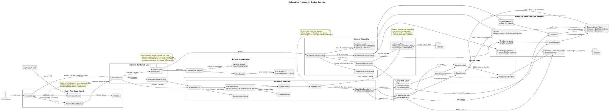
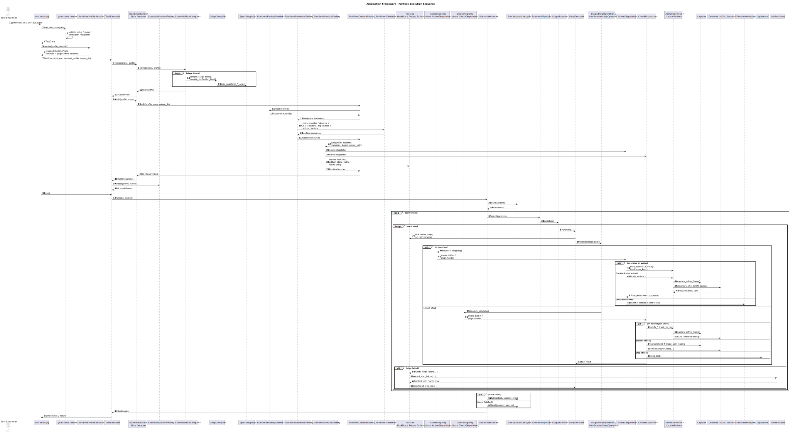
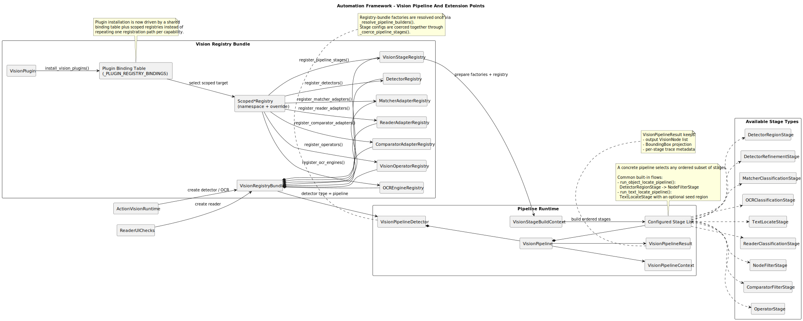
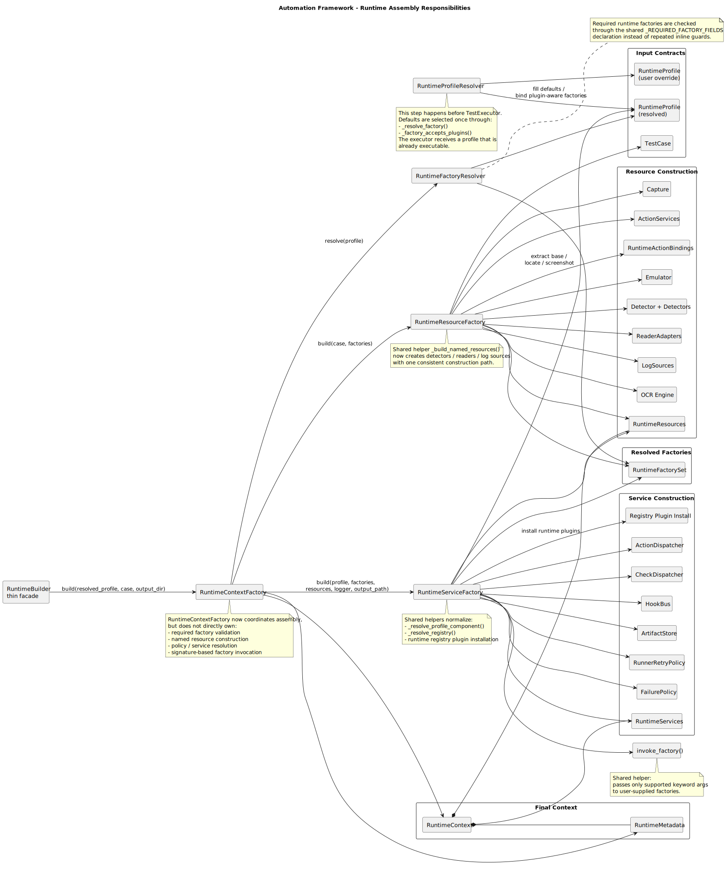
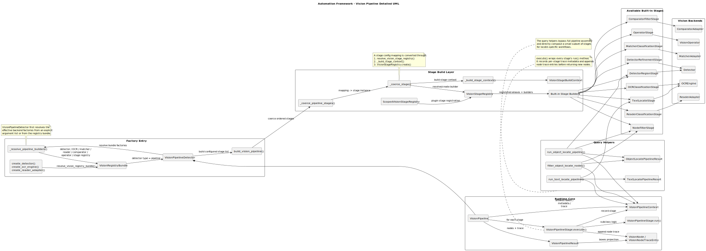

# System UML

This directory documents the automation framework from four complementary UML views:

- `uml/system-overview.puml`: high-level component view of the full system.
- `uml/runtime-sequence.puml`: end-to-end execution flow from CLI to step execution.
- `uml/runtime-assembly.puml`: focused view of runtime assembly responsibilities.
- `uml/vision-pipeline.puml`: vision subsystem and extension-point architecture.
- `uml/vision-pipeline-detail.puml`: detailed runtime and stage build view of the vision pipeline.
- `module-architecture.md`: per-module architecture views for each top-level package under `autoscene/`.
- `module-call-flow.md`: per-module function call flow views for each top-level package under `autoscene/`.

The runtime diagrams reflect the current refactor where `RuntimeProfileResolver` resolves defaults and plugin-aware factories up front, `TestExecutor` consumes that resolved profile, runner selection is delegated to `ScenarioRunnerFactory`, session state transitions live in `RunSessionLifecycle`, the default pipeline is driven by `StageDefinition` entries executed through a generic `StageRunner`, step execution delegates to stage-specific operations, `RuntimeBuilder` is only a thin facade, plan compilation lives in `ScenarioPlanCompiler`, runtime assembly is split across `RuntimeFactoryResolver`, `RuntimeResourceFactory`, `RuntimeServiceFactory`, and `RuntimeContextFactory`, failure handling is normalized in `runtime_policies.py`, and vision plugins are installed through scoped registry bindings before `VisionPipelineDetector` resolves its pipeline builders.

Render the diagrams with the repository helper:

```powershell
.\tools\render_docs_diagrams.ps1 -Formats svg
```

Generated SVG files are referenced below for quick browsing.

## 1. System Overview

Source: [uml/system-overview.puml](uml/system-overview.puml)



## 2. Runtime Sequence

Source: [uml/runtime-sequence.puml](uml/runtime-sequence.puml)



## 3. Vision Pipeline And Extension Points

Source: [uml/vision-pipeline.puml](uml/vision-pipeline.puml)



## 4. Runtime Assembly

Source: [uml/runtime-assembly.puml](uml/runtime-assembly.puml)



## 5. Vision Pipeline Detail

Source: [uml/vision-pipeline-detail.puml](uml/vision-pipeline-detail.puml)



## 6. Module Architecture Atlas

See [module-architecture.md](module-architecture.md) for package-level architecture diagrams covering:

- `core`
- `yamlcase`
- `actions`
- `capture`
- `emulator`
- `logs`
- `imaging`
- `vision`
- `runner`

## 7. Module Call Flow Atlas

See [module-call-flow.md](module-call-flow.md) for per-module function call diagrams covering:

- `core`
- `yamlcase`
- `actions`
- `capture`
- `emulator`
- `logs`
- `imaging`
- `vision`
- `runner`
