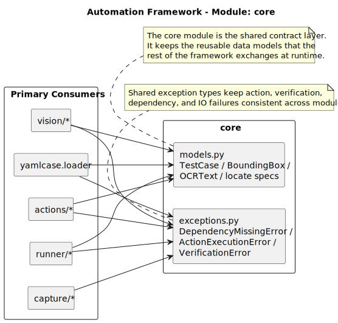
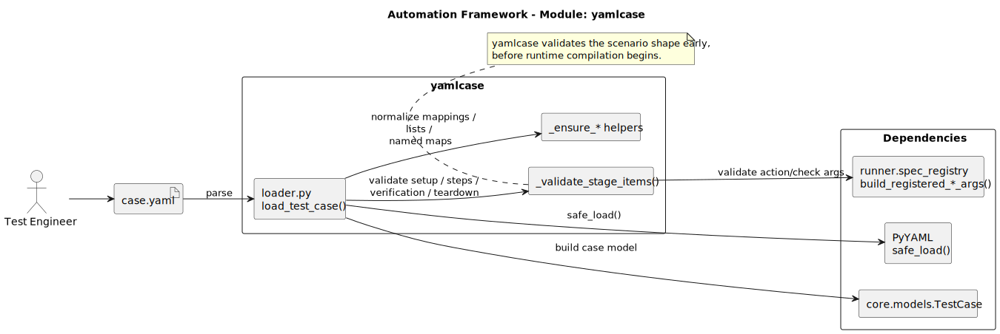
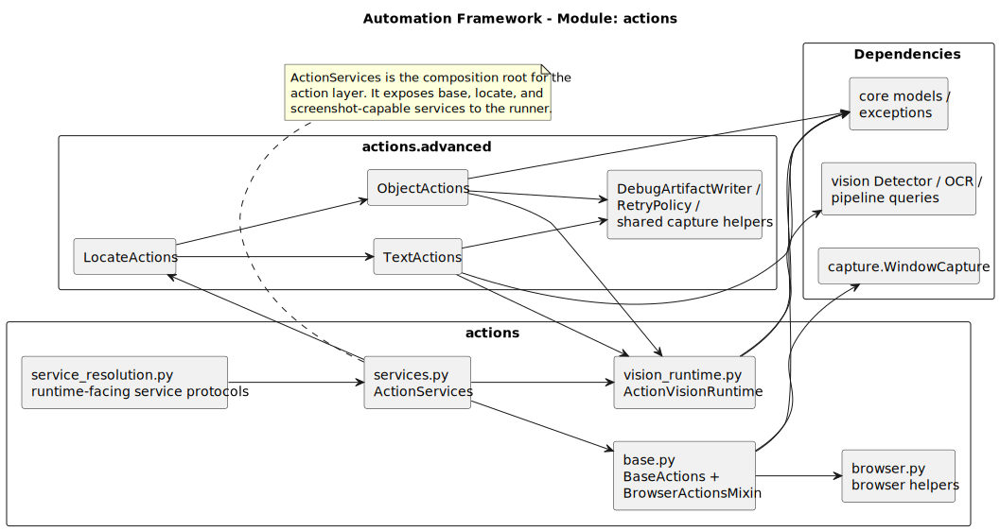
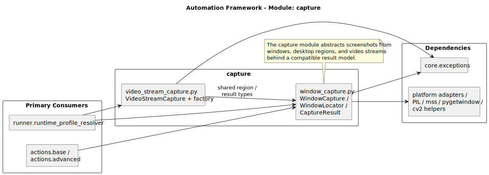
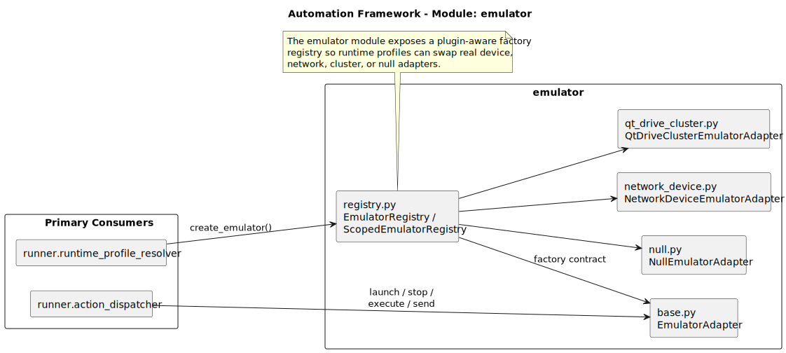
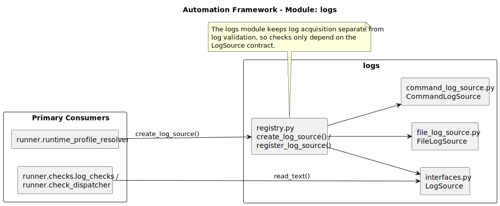
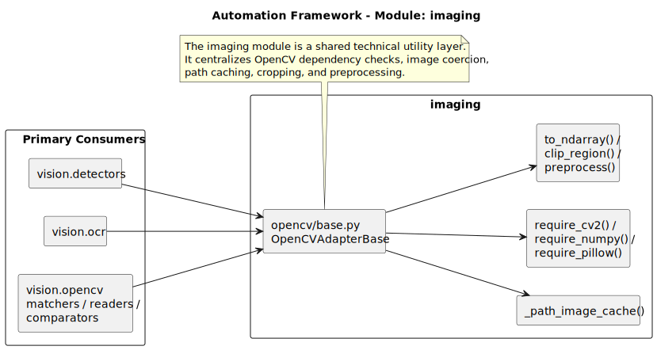
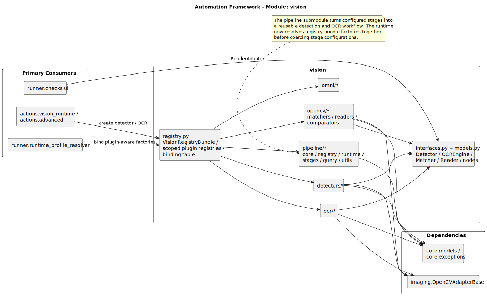
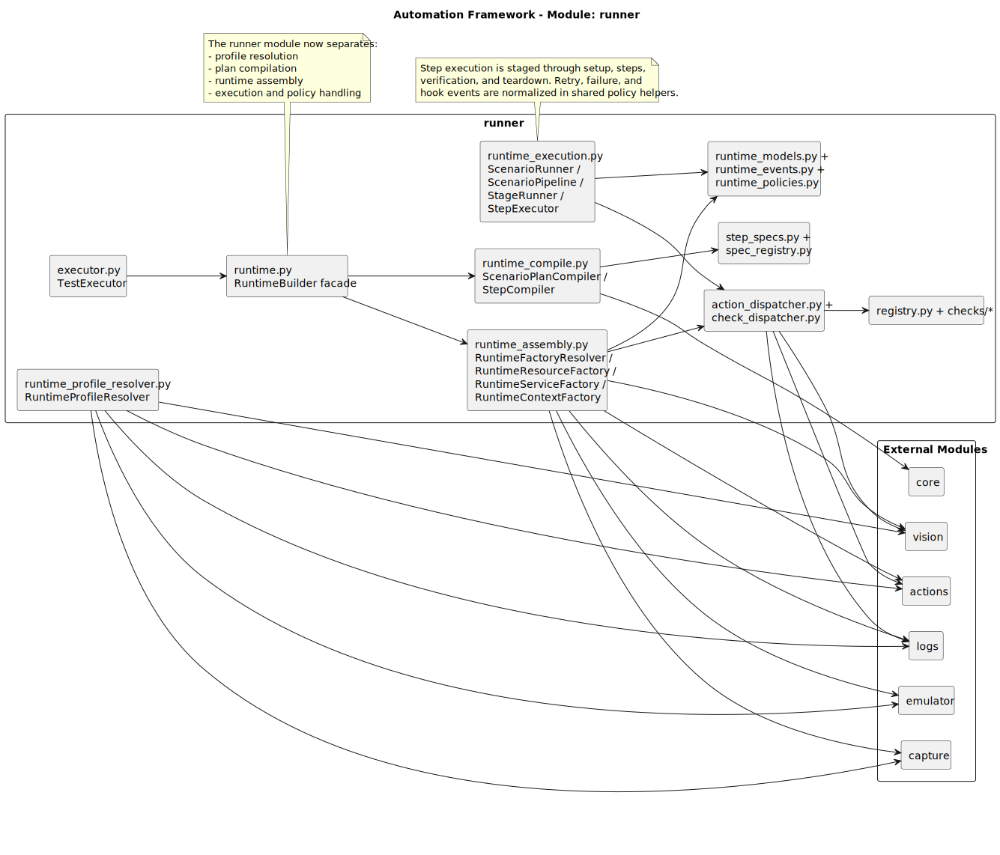

# Module Architecture Atlas

This page complements the system-level UML with package-level views for each top-level module under `autoscene/`.

Render or refresh the diagrams with:

```powershell
.\tools\render_docs_diagrams.ps1 -Formats svg
```

## 1. Core

Source: [uml/modules/module-core.puml](uml/modules/module-core.puml)



## 2. Yamlcase

Source: [uml/modules/module-yamlcase.puml](uml/modules/module-yamlcase.puml)



## 3. Actions

Source: [uml/modules/module-actions.puml](uml/modules/module-actions.puml)



## 4. Capture

Source: [uml/modules/module-capture.puml](uml/modules/module-capture.puml)



## 5. Emulator

Source: [uml/modules/module-emulator.puml](uml/modules/module-emulator.puml)



## 6. Logs

Source: [uml/modules/module-logs.puml](uml/modules/module-logs.puml)



## 7. Imaging

Source: [uml/modules/module-imaging.puml](uml/modules/module-imaging.puml)



## 8. Vision

Source: [uml/modules/module-vision.puml](uml/modules/module-vision.puml)



## 9. Runner

Source: [uml/modules/module-runner.puml](uml/modules/module-runner.puml)


