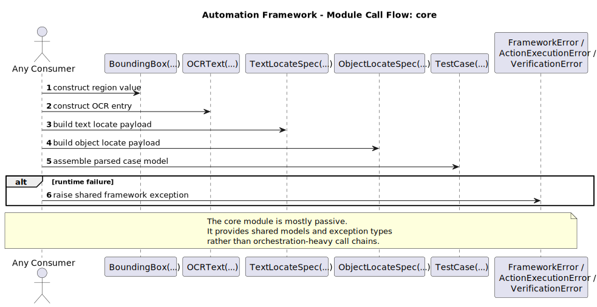
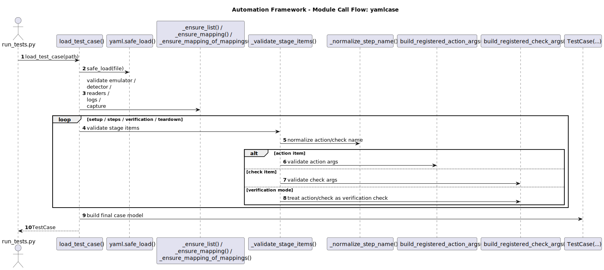
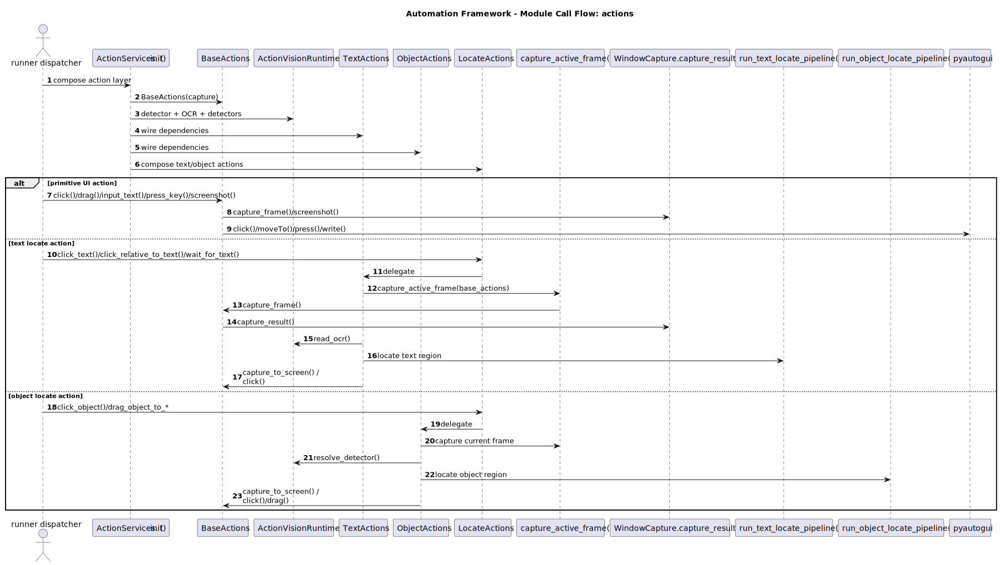
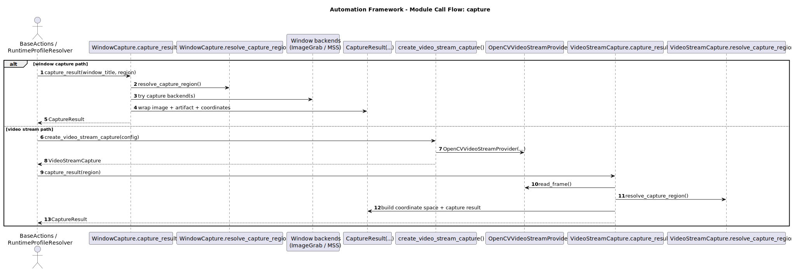
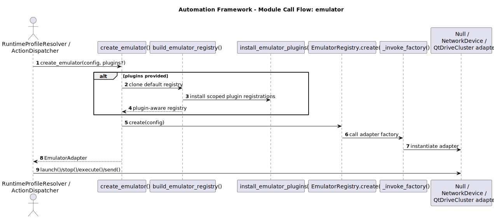
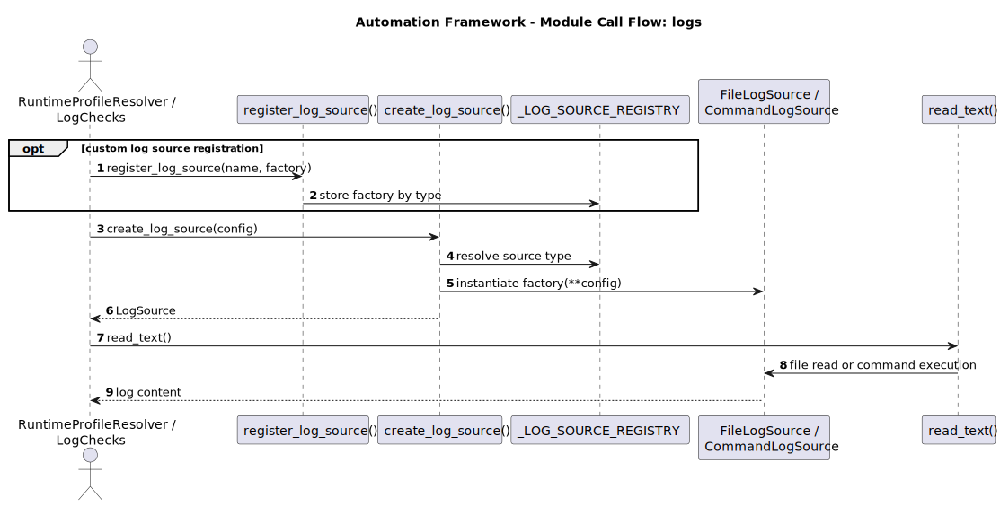
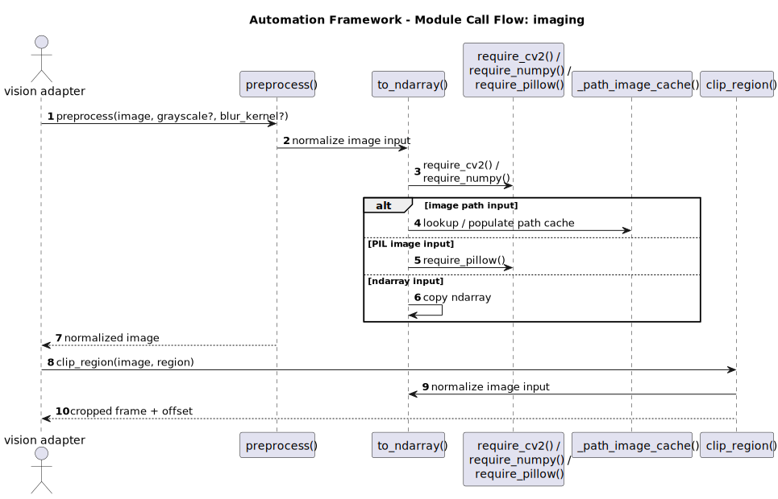
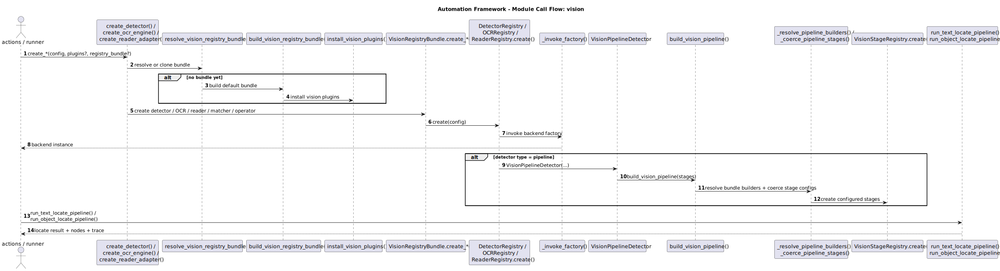
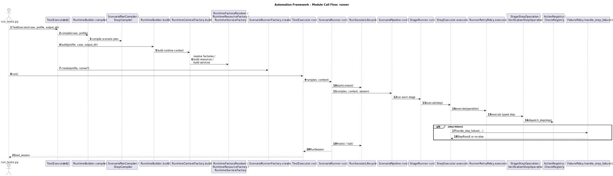

# Module Call Flow Atlas

This page complements the package architecture diagrams with higher-level function call flow views for each top-level module under `autoscene/`.

These diagrams focus on the main public entry points and the dominant internal call chains. They do not attempt to show every private helper, which would make the diagrams harder to read than the code.

Render or refresh the diagrams with:

```powershell
.\tools\render_docs_diagrams.ps1 -Formats svg
```

## 1. Core

Source: [uml/call-flows/call-core.puml](uml/call-flows/call-core.puml)



## 2. Yamlcase

Source: [uml/call-flows/call-yamlcase.puml](uml/call-flows/call-yamlcase.puml)



## 3. Actions

Source: [uml/call-flows/call-actions.puml](uml/call-flows/call-actions.puml)



## 4. Capture

Source: [uml/call-flows/call-capture.puml](uml/call-flows/call-capture.puml)



## 5. Emulator

Source: [uml/call-flows/call-emulator.puml](uml/call-flows/call-emulator.puml)



## 6. Logs

Source: [uml/call-flows/call-logs.puml](uml/call-flows/call-logs.puml)



## 7. Imaging

Source: [uml/call-flows/call-imaging.puml](uml/call-flows/call-imaging.puml)



## 8. Vision

Source: [uml/call-flows/call-vision.puml](uml/call-flows/call-vision.puml)



## 9. Runner

Source: [uml/call-flows/call-runner.puml](uml/call-flows/call-runner.puml)


